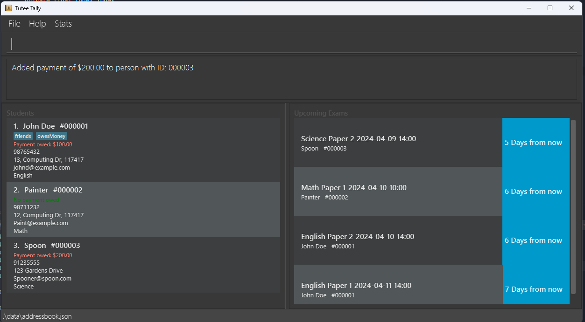
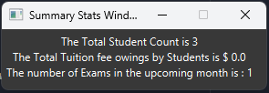

# TuteeTally User Guide

TuteeTally is a **desktop app for managing student contacts, optimized for use via a Command Line Interface** (CLI) while still having the benefits of a Graphical User Interface (GUI). If you can type fast, TuteeTally can make student management much easier and faster than traditional GUI apps.

The system includes features for adding students, viewing student details, viewing summary statistics, and deleting student entries. All inputs are case-insensitive, enhancing user accessibility.

<!-- * Table of Contents -->
<page-nav-print />

--------------------------------------------------------------------------------------------------------------------

## Quick start

1. Ensure you have Java `11` or above installed on your Computer.  
<box type="info" seamless>
Note: If you do not have Java 11 installed on your computer, you can download it from <a href="https://www.oracle.com/sg/java/technologies/javase-jdk11-downloads.html">here</a>.

Note: For MacOS users, a compatible Java 11 version is available <a href="https://www.azul.com/core-post-download/?endpoint=zulu&uuid=f3e69a90-5b80-4d6b-b14b-eb117b8ef0b4">here</a>.
</box>

2. Download the latest `tuteetally.jar` from [here](https://github.com/AY2324S2-CS2103T-F10-2/tp/releases).

3. Copy the file to your desired home folder.

4. Open a command terminal, `cd` into the folder you put the jar file in, and use the `java -jar tuteetally.jar` command to run the application. 
   A GUI similar to the one below should appear in a few seconds. Note how the app contains some sample data. 
   

5. Type the command in the command box and press Enter to execute it. e.g. typing **`help`** and pressing Enter will open the help window. 
   Some example commands you can try:

   * `add` - adding student to list
   * `delete` - deleting student from list
   * `view` - viewing student overview or details or statistics
   * `addpayment` - adding payment to student
   * `markpayment` - marking payment as paid for student
   * `resetpayments` - resetting payment for student
   * `addexam` - adding exam to student
   * `deleteexam` - deleting exam from student
   * `log` - logging a session's content, hours, learning styles and comments (notes) for each session
   
   <box type="info" seamless>
     Note: We noticed an existing bug that causes the exams of a student to disappear when we add a new payment.
     Will be fixed in V1.4.
   </box>

6. Refer to the [Features](#features) below for details of each command.

--------------------------------------------------------------------------------------------------------------------

## Features

<box type="info" seamless>

**Notes about the command format:** 
* Command words such as `add`, `delete` etc. are case-sensitive. 
   e.g. `Add` `ADD` `aDD` are invalid for the add command

* Words in `{UPPER_CASE}` are the parameters to be supplied by the user. 
  e.g. in `-name/{NAME}`, `NAME` is a parameter that can be used as `add -name John Doe`.

* Parameters can be in any order. 
  e.g. if the command specifies `-name {NAME} -address {ADDRESS}`, `-address {ADDRESS} -name {NAME}` is also acceptable.

* All id inputs in commands labelled `{ID}` can omit any leading 0s. 
e.g. `1`, `01`, `000001` are all valid id inputs for the id `#000001`

* Date inputs must be in the format `yyyy-MM-dd` format.  
e.g. `2024-04-01` is a valid input for date, but not `2024-4-01` or `2024-04-1`

* Time inputs are in the 24-hour format in the form `HH-mm`.  
e.g. `07:00` is a valid time input and refers to 7am, but not `7:00` 

* If you are using a PDF version of this document, be careful when copying and pasting commands that span multiple lines as space characters surrounding line-breaks may be omitted when copied over to the application.
</box>

### Adding a student: `add`

Adds a student's particulars into the address book.

Format: `add -name {NAME} -phone {NUMBER} -email {EMAIL} -address {ADDRESS} -subject {SUBJECT} t/{tag}`

<box type="tip" seamless>
Tip: 
If the addition is successful, the new student record will be shown at the bottom of the list.
</box>
<box type="info" seamless>
Note: 
The `t/{tag}` field is optional and can be used to add a tag to the student record and no spaces are allowed in the {tag}.
</box>

Examples:
* `add -name Xiao Ming -address 13, Computing Dr, 117417 -email xiaoming@email.com -phone 88888888 -subject Math`

### Editing a student: `edit`

Edit the specific student detail from TuteeTally using the ID.

Parameters: INDEX (must be a positive integer) [-nameNAME] [-phonePHONE] [-emailEMAIL] [-addressADDRESS] [-subjectSUBJECT] [t/TAG]... 
Editable Fields
- `Name`
- `Phone`
- `Email`
- `Address`
- `Tags`

At least one editable fields must be present. Not all editable values need to be present at one time.

Format: `edit {ID} -<Insert Field to Edit> {Value}`

Example: 
* `edit 1 -phone91234567 -emailjohndoe@example.com -nameJohnDoo`

### Deleting a student: `delete`

Deletes the specified student from the address book.

Format: `delete -id {ID}`

* Deletes the person at the specified `id`.

Examples:
* `delete -id 000001 / 1` deletes the student with the id 000001

### View student statistics: `view`
This would display the following in a pop-up window 
- the total number of students 
- the total amount owed by students
- the number of upcoming exams in the following month

Press `F2` on the keyboard to access the `stats` view or type the below commands

Format 1: `view -statistics`
Format 2: `view -stats`

### View full student list on the home page: `view`
This would display all students currently added to the list. Each student's contact information and subject information will be displayed with this command.
Format: `view -all`

### View student particular by name: `view`
This will display students whose name matches any single word in the `{NAME}` search field.
* i.e. `view -name alex tan` will retrieve any student with the word `alex` or `tan` in their name. `Alex Yeo` and `James Tan` are both valid students to display in this case.
Format: `view -name {NAME}`
Examples:
* `view -name Xiao Ming` would display the student particular of Xiao Ming if existed

### View student particular by id: `view`
This will display a specific student by searching for their id, this also pops up the lesson logs of the student.
Format: `view -id {ID}`

Examples:
* `view -id 88888` would display the student particular for the student whose id is 88888 if it exists.

### Add payment for the student by id: `addpayment`
This will add a payment to a student by searching for their `id`
Format: `addpayment -id {ID} -payment {AMOUNT}`
Examples:
* `addpayment -id 88888 -payment 100` would add a payment of 100 to the student whose id is 88888 if it exists.

### Mark student's payment as paid by id: `markpayment`
This will mark a specified amount of a student's payment as paid. The command searches for their `id`, and reduces the total outstanding payment amount of the student by `{AMOUNT}`.
Format: `markpayment -id {ID} -payment {AMOUNT}`
Examples:
* `markpayment -id 88888 -payment 100` would mark a payment of 100 as paid for the student whose id is 88888 if it exists. If the student had $150 of outstanding payments, the display will now show $50.

### Reset student's payment by id: `resetpayment`
This will reset a student's payment to 0 by searching for their `id`. 
Format: `resetpayments -id {ID}`
Examples:
* `resetpayments -id 88888` would reset the payment for the student whose id is 88888 if it exists.

### Add student's exam by id: `addexam`
This will add an exam to a student by searching for their `id`. Time is an optional field.
Format 1: `addexam -id {ID} -exam {EXAMNAME} -date {DATE}`
Format 2: `addexam -id {ID} -exam {EXAMNAME} -date {DATE} -time {TIME}`
Examples:
* `addexam -id 888888 -exam Computing -date 2024-04-27 -time 09:00` would add an exam of Computing with date of 2024-04-27 and time of 09:00 to a student whose id is 888888 if the student exists.

### Delete student's exam by id: `deleteexam`
This will delete an exam from a student by searching for their `id`. Fields should follow exactly from the exam from the exam list that you wish to delete.
Format 1: `deleteexam -id {ID} -exam {EXAMNAME} -date {DATE}`
Format 2: `deleteexam -id {ID} -exam {EXAMNAME} -date {DATE} -time {TIME}`
Examples:
* `deleteexam -id 888888 -exam Computing -date 2024-04-27 -time 09:00` would delete an exam of Computing with date of 2024-04-27 and time of 09:00 from a student whose id is 888888 if the student exists.

### Logging the Lessons of a student: `log`
This will log the lessons of a student. The time field of the log entry will be the system time when the log was added.
Format `log -id {ID} -hours {HOURS} -content {CONTENT} -style {LEARNING STYLE} -notes {NOTES}
Examples:
* `log -id 1 -hours 2 -content English Comprehension -style Visual -notes Great improvement!`. would log a lesson for ID 1 noting that it had great improvement in English Comprehension, it also logs the learning style of the student

### More features `[coming in v1.4]`

_Details coming soon ..._

--------------------------------------------------------------------------------------------------------------------

## FAQ

**Q**: How do I transfer my data to another Computer? 
**A**: Install the app on the other computer and overwrite the empty data file it creates with the file that contains the data of your previous AddressBook home folder.

**Q**: What are the system requirements for TuteeTally? 
**A**: TuteeTally requires Java 11 or above to run. It is compatible with Windows, MacOS, and Linux operating systems.

--------------------------------------------------------------------------------------------------------------------

## Known issues

1. **When using multiple screens**, if you move the application to a secondary screen, and later switch to using only the primary screen, the GUI will open off-screen. The remedy is to delete the `preferences.json` file created by the application before running the application again.

--------------------------------------------------------------------------------------------------------------------
## Command summary

| Action           | Format, Examples                                                                                                                                                                                                                         |
|------------------|------------------------------------------------------------------------------------------------------------------------------------------------------------------------------------------------------------------------------------------|
| **Add**          | `add -name {NAME} -email {EMAIL} -phone {number} -address {ADDRESS} -subject {SUBJECT} t/{tag}`   e.g., `add -name Xiao Ming -phone 88888888 -email xiaoming@gmail.com -address 13, Computing Dr, 117417  -subject Math t/bestfriend` |
| **Delete**       | `delete -id {id}`  e.g., `delete -id 88888`                                                                                                                                                                                           |
| **Edit**         | `edit {ID} -<Editable Fields> {Value}`   e.g., `edit 1 -phone91234567 -emailjohndoe@example.com -nameJohn Doo`                                                                                                                        |
| **View**         | `view [-statistics] [-all] [-id ID] [-name NAME]`                                                                                                                                                                                        |
| **AddPayment**   | `addpayment -id {ID} -payment {AMOUNT}`  e.g., `addpayment -id 88888 -payment 100`                                                                                                                                                    |
| **MarkPayment**  | `markpayment -id {ID} -payment {AMOUNT}`  e.g., `markpayment -id 88888 -payment 100`                                                                                                                                                  |
| **ResetPayment** | `resetpayments -id {ID}`  e.g., `resetpayments -id 88888`                                                                                                                                                                             |
| **AddExam**      | `addexam -id {ID} -exam {EXAMNAME} -date {DATE} -time {TIME OPTIONAL}`   e.g., `addexam -id 888888 -exam Computing -date 2024-04-27 -time 09:00`                                                                                      |
| **DeleteExam**   | `deleteexam -id {ID} -exam {EXAMNAME} -date {DATE} -time {TIME}` or `deleteexam -id {ID} -exam {EXAMNAME} -date {DATE}`   e.g., `deleteexam -id 888888 -exam Computing -date 2024-04-27 -time 09:00`                                  |
| **Log**          | `log -id {ID} -hours {HOURS} -content {CONTENT} -style {LEARNING STYLE} -notes {NOTES}`   e.g., `log -id 1 -hours 2 -content English Comprehension -style Visual -notes Great improvement!`                                           |
