# TuteeTally User Guide

TuteeTally is a **desktop app for managing student contacts for private tutors, optimized for use via a Command Line Interface** (CLI)
while still having the benefits of a Graphical User Interface (GUI). If you can type fast, TuteeTally can make student
management much easier and faster than traditional GUI apps.

The system includes features for adding students, viewing student details, viewing summary statistics, and deleting student entries.  
<box type="info" seamless>

**Note**:  
All commands are case-sensitive.
</box>

<!-- * Table of Contents -->
<page-nav-print />

--------------------------------------------------------------------------------------------------------------------

## Quick start

1. Ensure you have Java `11` or above installed on your Computer.  
<box type="info" seamless>

**Note:**  
* If you do not have Java 11 installed on your computer, you can download it from <a href="https://www.oracle.com/sg/java/technologies/javase-jdk11-downloads.html">here</a>.  
* For MacOS users, a compatible Java 11 version is available <a href="https://www.azul.com/core-post-download/?endpoint=zulu&uuid=f3e69a90-5b80-4d6b-b14b-eb117b8ef0b4">here</a>.
</box>

2. Download the latest `tuteetally.jar` from [here](https://github.com/AY2324S2-CS2103T-F10-2/tp/releases).

3. Save the file to your desired home folder that will serve as the main folder for TuteeTally.

4. Open a command terminal,
    * For Windows users: Press `Win + R`, type `cmd` or `PowerShell`, and press `Enter`.
    * For MacOS users: Press `Cmd + Space`, type `Terminal`, and press `Enter`.
    * For Linux users: Press `Ctrl + Alt + T`.

5. Navigate into the folder where you saved `tuteetally.jar`. 
   By default, it should be saved in your `Downloads` folder.  
    * For Windows users: Type `cd Downloads`, and press `Enter`.
    * For MacOS users: Type `cd ~/Downloads`, and press `Enter`.
    * For Linux users: Type `cd ~/Downloads`, and press `Enter`.

6. Type the command  `java -jar tuteetally.jar` to into the terminal to run the application. A GUI similar to the one below should appear in a few seconds. Note how the app contains some sample data. 
   

7. You can now type in any commands in the command box and press Enter to execute it. e.g. typing **`help`** and pressing Enter will open the help window. 
   Some example commands you can try:

   * `add` - adding student to list
   * `delete` - deleting student from list
   * `view` - viewing student overview or details or statistics
   * `addpayment` - adding payment to student
   * `markpayment` - marking payment as paid for student
   * `resetpayments` - resetting payment for student
   * `addexam` - adding exam to student
   * `deleteexam` - deleting exam from student
   * `log` - logging a session's content, hours, learning styles and comments (notes) for each session  

6. Refer to the [Features](#features) below for details of each command.  

--------------------------------------------------------------------------------------------------------------------
## Glossary

| Term          | Explanation                                                                                                                                        |
|---------------|----------------------------------------------------------------------------------------------------------------------------------------------------|
| **CLI**       | `A command-line interface (CLI) is a text-based user interface used to interact with programs, in this case TuteeTally!`                           |
| **GUI**       | `A graphical user interface (GUI) is a digital interface in which a user interacts with graphical components such as icons, buttons, and menus.`   |
| **Payment**   | `A Payment is the amount of money that a student owes to the tutor for the lessons that have been conducted.`                                      |
| **Exam**      | `An Exam is any assessment or Test that the tutor choose to keep track of a student`                                                               |
| **Index**     | `The index of the student refers to the position of student counting from the top of current displayed list, with the first student being index 1` |
| **UniqueID**  | `The UniqueID of a student refers to a uniquely generated identity that is assigned to a student when he or she is added to TuteeTally.`           |
--------------------------------------------------------------------------------------------------------------------

## Features

<box type="info" seamless>

**Notes about the command format:** 
* Command words such as `add`, `delete` etc. are case-sensitive. 
   e.g. `Add` `ADD` `aDD` are invalid for the add command

* Words in `{UPPER_CASE}` are the parameters to be supplied by the user. 
  e.g. in `-name/{NAME}`, `NAME` is a parameter that can be used as `add -name John Doe`.

* Parameters can be in any order. 
  e.g. if the command specifies `-name {NAME} -address {ADDRESS}`, `-address {ADDRESS} -name {NAME}` is also acceptable.

* All id inputs in commands labelled `{ID}` can omit any leading 0s. 
e.g. `1`, `01`, `000000001` are all valid id inputs for the id `#000001`

* All `{ID}` are by default a positive integer of maximum *6 digits*. Any ID that exceeds a positive 6 digit integer number (e.g. 1234567) may cause errors.

* The maximum number of students that can be stored in TuteeTally is 999999.

* If you are using a PDF version of this document, be careful when copying and pasting commands that span multiple lines as space characters surrounding line-breaks may be omitted when copied over to the application.
</box>

**Notes on Fields for the students**

| Field       | Prefix        | Required | Caveats                                                                                                                                                                                                                                                                                                                                                                                                |
|-------------|---------------|--------|--------------------------------------------------------------------------------------------------------------------------------------------------------------------------------------------------------------------------------------------------------------------------------------------------------------------------------------------------------------------------------------------------------|
| **Name**    | `-name`       | Yes    | Names should only contain alphanumeric characters and spaces, it cannot contain special characters. |
| **Phone**   | `-phone`      | Yes    | Phone numbers should only contain numbers, and it should be at least 3 digits long   There is no limit on the length of the phone number to accommodate worldwide phone numbers.                                                                                                                                                                                                                   |
| **Email**   | `-email`      | Yes    | Emails does not require top level domain, it only requires `@`, for example admin@example. More info on valid email formatting can be found  on this wikipedia article<a href="https://en.wikipedia.org/wiki/Email_address#Examples"> here</a>.                                                                                                                                                        |
| **Address** | `-address`    | Yes    | Addresses can take any values, and it should not be blank                                                                                                                                                                                                                                                                                                                                              |
| **Subject** | `-subject`    | Yes    | Subjects can take any values, and it should not be blank.                                                                                                                                                                                                                                                                                                                                              |
| **Tag**     | `t/`          | No     | Tags names should be alphanumeric and not contain any special characters.                                                                                                                                                                                                                               |

### Adding a student: `add`

Adds a student's particulars into the address book.

**Format:** `add -name {NAME} -phone {NUMBER} -email {EMAIL} -address {ADDRESS} -subject {SUBJECT} t/{tag}`

<box type="tip" seamless>

**Tip:** 
If the addition is successful, the new student record will be shown at the bottom of the list.
Long names might also cause the ID field to be blocked. In this case, you can opt to drag the middle portion of the UI to
reveal the ID. However, the upper limit of this workaround is 220 characters long. If a student's name exceeds 220 characters,
it is advisable to use nicknames instead.

</box>

There is currently no detection for duplicates, this is under planned enhancements.

<box type="info" seamless>

**Note:** 

The `t/{tag}` field is **OPTIONAL** and can be used to add tag(s) to the student record and no spaces are allowed for `t/{tag}`.
</box>

**Example:**
* `add -name Xiao Ming -address 13, Computing Dr, 117417 -email xiaoming@email.com -phone 88888888 -subject Math`

After entering the command, the interface will update as shown below:

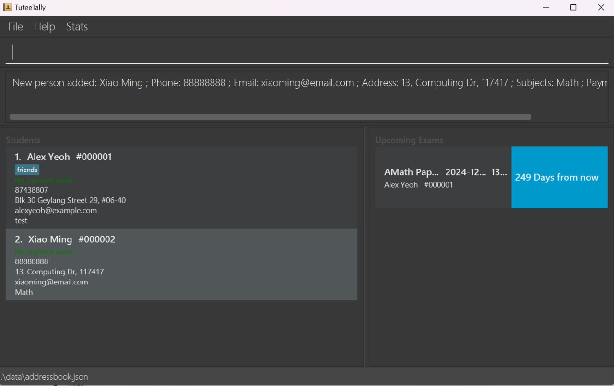 _The display showing *ALL* the students after a new student gets added._

### Editing a student: `edit`

Edit the specific student detail from TuteeTally using the *INDEX* of the student.  
The index of the student refers to the position of student counting from the top of current displayed list, with the first student being index 1.
 
Parameters: INDEX (must be a positive integer) [-name NAME] [-phone PHONE] [-email EMAIL] [-address ADDRESS] [t/TAG]...
Editable Fields
- `Name`
- `Phone`
- `Email`
- `Address`
- `Tags`

At least one editable fields must be present. Not all editable values need to be present at one time.

**Format:** `edit {ID} -<Insert Field to Edit> {Value}`

**Example:**
* `edit 1 -phone 91234567 -email johndoe@example.com -name JohnDoo`

After entering the command, the interface will update as shown below:

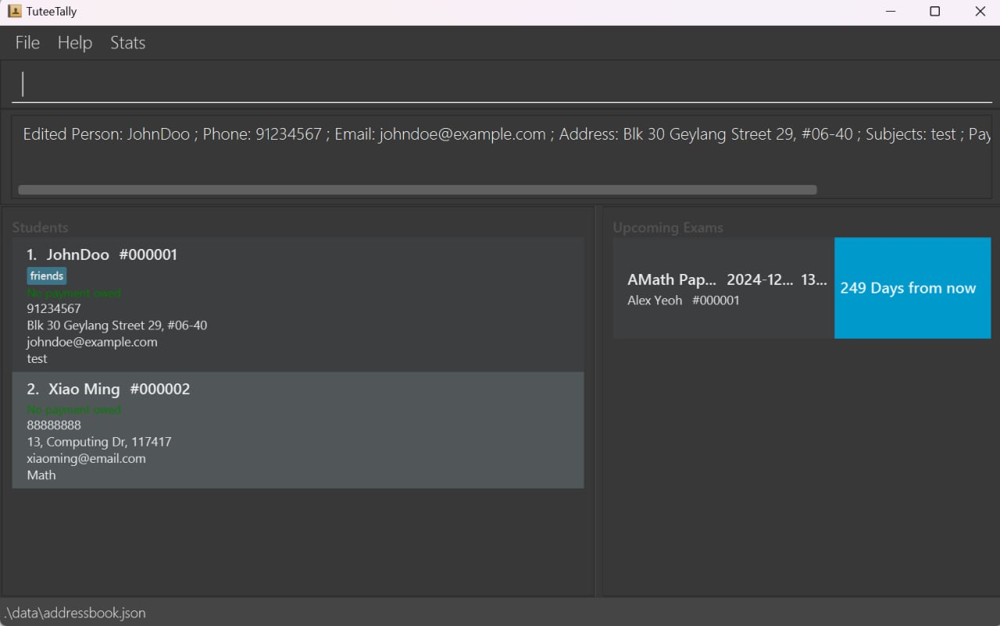 _The display showing the edited student with the INDEX 1._

### Deleting a student: `delete`

Deletes the specified student from the address book.

**Format:** `delete -id {ID}`

* Deletes the person at the specified `id`.

**Examples:**
* `delete -id 000001` or `delete -id 1` deletes the student with the ID #000001

After entering the command, the interface will update as shown below:

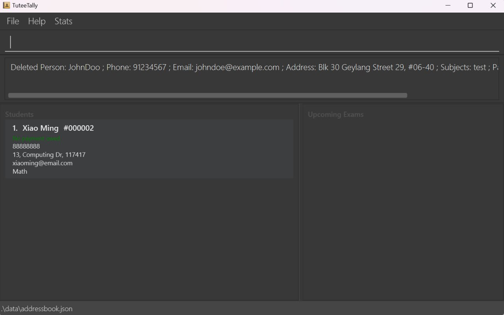 _The display showing *ALL* the students after the student with the ID #000001 gets deleted._

## Enhanced Students Profile Viewing: `view`

View the details of a student by searching for their `id`, `name`, or view all students. More specific details of different view commands are in the sections below.  

For this feature, we have added more students in the list to demonstrate the different views available.  

These student details can be found in the `test.json` file that we have included in the `data` folder.  

<box type="tip" seamless>

**Tip:**  
To match the results shown in the illustrations within our User Guide, we recommend replacing the contents of the `data/tuteetally.json`file in your directory where `TuteeTally.jar` is saved with the data from [here](https://github.com/AY2324S2-CS2103T-F10-2/tp/tree/
  /DummyData/dummydata.json).  
This will ensure your outputs align with the examples provided in our guide.  

</box>

### View student statistics: `view -stats`
This would display the following in a pop-up window
- the total number of students
- the total amount owed by students (Currently shows the exact amount)
- the number of upcoming exams in following 1 month period (from today up to the same day of the next month)

<box type="tip" seamless>

**Tip:** 
Use this feature to track the total amount of students you're teaching, how much is owed by all of them
and how plan your schedule based on the number of upcoming exams that will come in the next month

</box>

Press `F2` on the keyboard to access the `stats` view or type the below commands

**Format 1:** `view -statistics`  
**Format 2:** `view -stats`  

After entering the command, the interface will update as shown below:

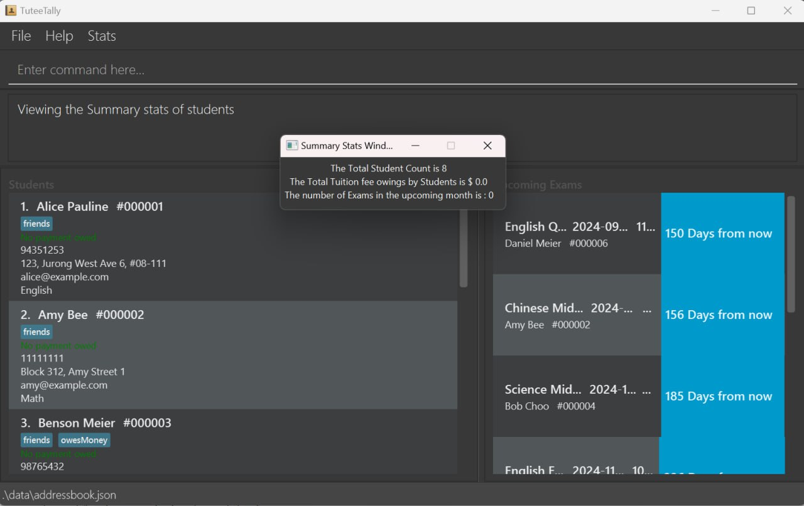 _The display showing the stats of *ALL* the students._

### View full student list on the home page: `view -all`
This would display all students currently added to the list. Each student's contact information and subject information will be displayed with this command.  
**Format:** `view -all`  

After entering the command, the interface will update as shown below:

 _The display showing *ALL* the students._

### View student particular by name: `view -name`
This will display students whose name matches any single word in the `{NAME}` search field.
* i.e. `view -name alex tan` will retrieve any student with the word `alex` or `tan` in their name. `Alex Yeo` and `James Tan` are both valid students to display in this case.  

**Format:** `view -name {NAME}`  

**Example:**
* `view -name Benson Meier` would display the student particular of Benson Meier if existed or any student with the word `Benson` or `Meier` in their name.  

After entering the command, the interface will update as shown below:

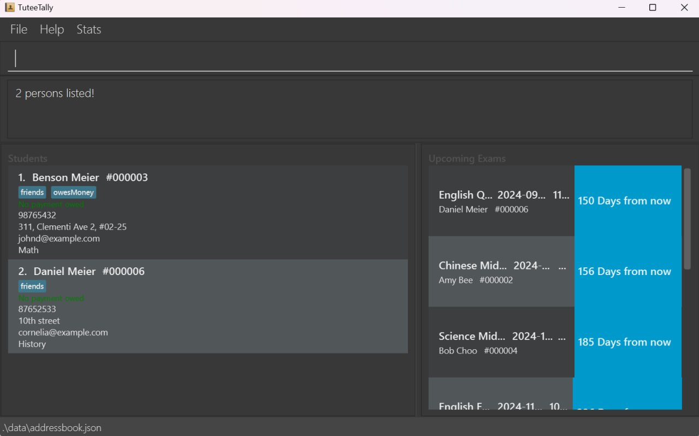 _The display showing *ALL* the students with the word `Benson` or `Meier` in their name._

### View student particular by id: `view -id`
This will display a specific student by searching for their id, this also pops up the lesson logs of the student.  
**Format:** `view -id {ID}`

**Example:**
* `view -id 000003` would display the student particular for the student with ID #000003 if it exists.  

After entering the command, the interface will update as shown below:

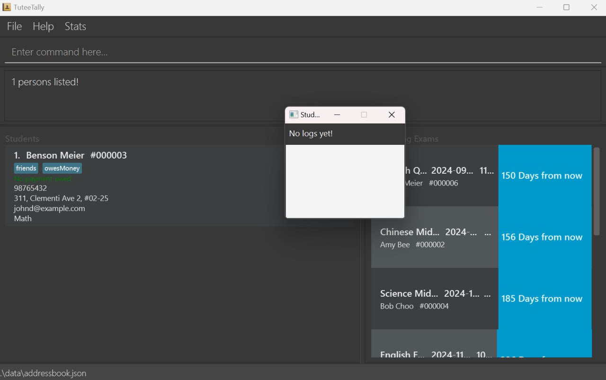 _The display showing the student with the ID #000003._

## Enhanced Payment Management

TuteeTally's payment management commands are designed to streamline the financial interactions between tutors and students, ensuring accuracy and transparency. Below are detailed explanations of each command's purpose and benefits:

<box type="info" seamless>

**Note:**  
* Displayed payment amounts are rounded to the nearest $0.01. However, TuteeTally accurately tracks the exact amounts entered, without rounding.  

</box>

### Adding a Payment: `addpayment`

Record new payments easily with the `addpayment` command, keeping track of what each student owes. This command simplifies the maintenance of financial records, ensuring you never overlook an outstanding payment.

**Format:** `addpayment -id {ID} -payment {AMOUNT}`

**Example:**
* `addpayment -id 000001 -payment 150` or `addpayment -id 1 -payment 150` would add a payment of 150 to the student with ID #000001 if it exists.  

After entering the command, the interface will update as shown below:

 _The display showing "Payment owed: $150.00" after adding a payment._

### Marking Payment of the student: `markpayment`

The `markpayment` command allows you to update the status of a student's payment to reflect payments that have been made. This feature helps maintain a clear record of completed transactions, building trust and transparency.  

**Format:** `markpayment -id {ID} -payment {AMOUNT}`

**Example:**
* `markpayment -id 000001 -payment 100` or `markpayment -id 1 -payment 100` with ID #000001 if it exists.  

After entering the command, the interface will update as shown below:  

 _The display showing "Payment owed: $5.000" after marking a payment of $100.00, with $150.00 owed initially._

<box type="info" seamless>

**Note:**  
* If the amount marked as paid exceeds the total outstanding payment, the total outstanding payment will be set to 0.  
* If the amount owed by student is already 0, you are still allowed to enter the command, but there will be no changes.  

</box>

### Resetting all Payments of the student: `resetpayments`
<box type="info" seamless>

**For your information:**  
The command `resetpayments` intentionally includes an 's' after `payment` because it is designed to reset all owed payments for a student.  
</box>

Use the `resetpayments` command to clear a student's outstanding payment amount, useful for starting anew or correcting mistakes. This command ensures your financial records remain accurate and up-to-date. 

**Format:** `resetpayments -id {ID}`

**Example:**
* `resetpayments -id 000001` or `resetpayments -id 1` would reset the payment for the student with ID #000001 if it exists.

After entering the command, the interface will update as shown below:  

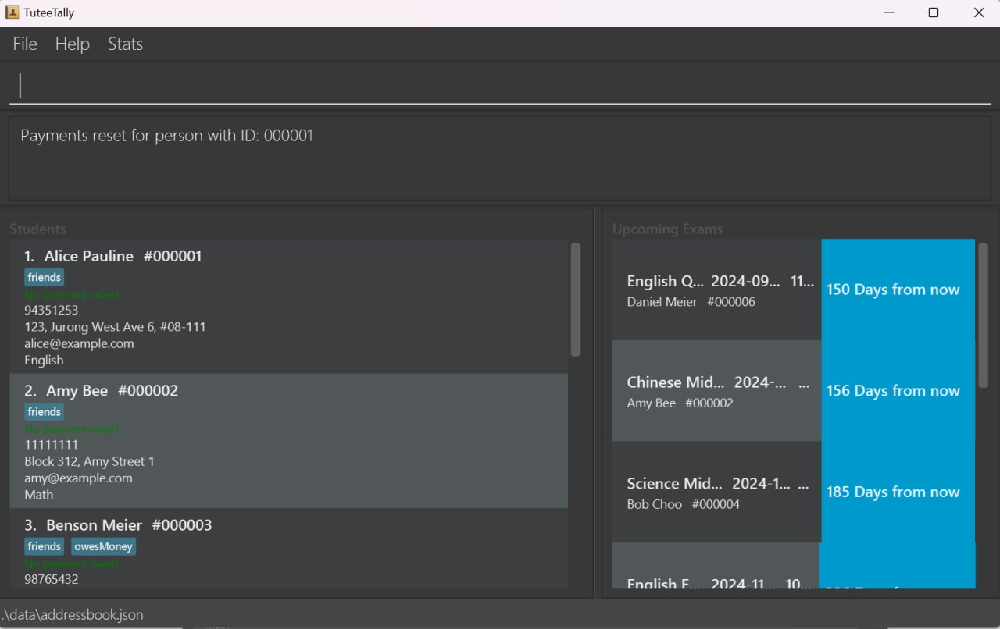 _The display showing "No payment owed" after resetting payments, with $50.00 owed previously._

<box type="info" seamless>

**Note:**  
* If the amount marked as paid exceeds the total outstanding payment, the total outstanding payment will be set to 0.  
* If the amount owed by student is already 0, you are still allowed to enter the command, but there will be no changes.  

</box>

Each of these features contributes to a comprehensive financial management system within TuteeTally, enabling tutors to manage their tutoring finances more effectively and efficiently.

### Add student's exam by id: `addexam`
This will add an exam to a student by searching for their `ID`. Time is an optional field. Do note that only exams from the current date onwards can be added.

**Format 1:** `addexam -id {ID} -exam {EXAMNAME} -date {DATE}`  
**Format 2:** `addexam -id {ID} -exam {EXAMNAME} -date {DATE} -time {TIME}`

**Notes on Fields for add exam command**

| Field       | Prefix   | Required | Caveats                                                                                                                                                                                                                                                           |
|-------------|----------|----------|-------------------------------------------------------------------------------------------------------------------------------------------------------------------------------------------------------------------------------------------------------------------|
| **Unique ID** | `-id`    | Yes      | Unique ID must be a positive integer with a maximum length of 6 digits excluding leading zeros.   Leading zeros are optional. For example, `1`, `01`, and `000000001` are all valid representations for the ID #000001. IDs between `1` and `999999` (inclusive) are considered valid. |
| **Exam**    | `-exam`  | Yes      | Exam should be a string, special characters are allowed.                                                                                                                                                                                                          |
| **Date**    | `-date`  | Yes      | Date inputs must be in the format yyyy-MM-dd format. Date must be from current date onwards.   e.g. 2024-04-01 is a valid input for date, but not 2024-4-01 or 2024-04-1                                                                                       |
| **Time**    | `-time`  | Nope     | Time inputs are in the 24-hour format in the form HH:mm.   e.g. 07:00 is a valid time input and refers to 7am, but not 7:00                                                                                                                                    |

**Examples:**
* `addexam -id 000001 -exam Computing -date 2024-04-27 -time 09:00` would add an exam of Computing with date of 2024-04-27 and time of 09:00 to a student whose ID is #000001 if the student exists.

After entering the command, the interface will update as shown below:  

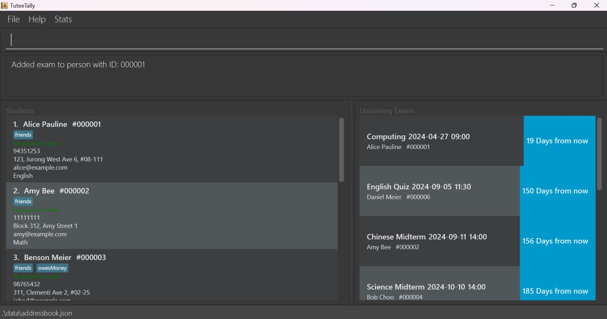 _The display showing a new `COMPUTING` exam of the student with ID #000001 after being added._

<box type="info" seamless>

**Note:**  
* This feature support adding an exam that is on current date but with a past time to allow for tracking exams happening on the same day.
* If the entered date is yyyy-02-29 in non leap year, 29th will be automatically converted to 28th. Exam of yyyy-02-28 will be added.

</box>

### Delete student's exam by id: `deleteexam`
This will delete an exam from a student by searching for their `ID`. Fields should follow exactly from the exam from the exam list that you wish to delete.

**Format 1:** `deleteexam -id {ID} -exam {EXAMNAME} -date {DATE}`  
**Format 2:** `deleteexam -id {ID} -exam {EXAMNAME} -date {DATE} -time {TIME}` 
**Examples:**
* `deleteexam -id 000001 -exam Computing -date 2024-04-27 -time 09:00` would delete an exam of Computing with date of 2024-04-27 and time of 09:00 from a student whose ID is #000001 if the student exists.

After entering the command, the interface will update as shown below:  

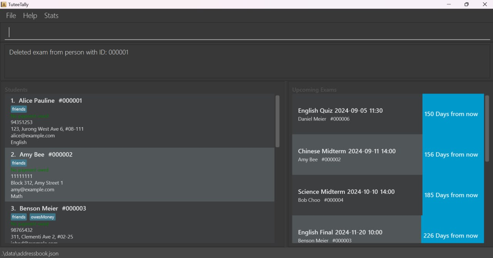 _The display, after the COMPUTING exam for the student with ID #000001 has been deleted, shows the updated status, confirming the successful removal of the exam._

<box type="info" seamless>

**Note:**  
* Past exams specified below will be automatically removed when the user opens TuteeTally at the current date to streamline exam management by Tutors.
   - Exam of past date and past time
   - Exam of past date
   - Exam of current date and past time
* To update the change to storage, user should use the command `exit` to exit the app.

</box>

### Logging the Lessons of a student: `log`

This will add a log to the lessons of a student. The time field of the log entry will be the *system time* when the log was added.

**Format:** `log -id {ID} -hours {HOURS} -content {CONTENT} -style {LEARNING STYLE} -notes {NOTES}`
<box type="info" seamless>

**Notes on Fields for log command**

| Field              | Prefix     | Required | Caveats                                                                                                                                                                                                                                                                                   |
|--------------------|------------|----------|-------------------------------------------------------------------------------------------------------------------------------------------------------------------------------------------------------------------------------------------------------------------------------------------|
| **Unique ID**      | `-id`      | Yes      | Unique ID must be a positive integer with a maximum length of 6 digits excluding leading zeros.   Leading zeros are optional. For example, `1`, `01`, and `000000001` are all valid representations for the ID #000001. IDs between `1` and `999999` (inclusive) are considered valid. |
| **Hours**          | `-hours`   | Yes      | Hours need not be an integer input to give you more flexibility. Values like `2 hours 45 mins`, `2+ hours` are valid as well.                                                                                                                                                             |
| **Content**        | `-content` | Yes      | Content should be a string, special characters are allowed.                                                                                                                                                                                                                               |
| **Learning Style** | `-style`   | Yes      | Learning style should be a string, special characters are allowed.                                                                                                                                                                                                                        |
| **Notes**          | `-notes`   | Yes      | Notes should be a string, special characters are allowed.                                                                                                                                                                                                                                 |

</box>

**Example:**  
* `log -id 000001 -hours 2 -content English Comprehension -style Visual -notes Great improvement!`. would log a lesson for the student with ID #000001 noting that he/she has had a great improvement in English Comprehension, it also logs the learning style of the student.  

After entering the command, the interface will update as shown below:  

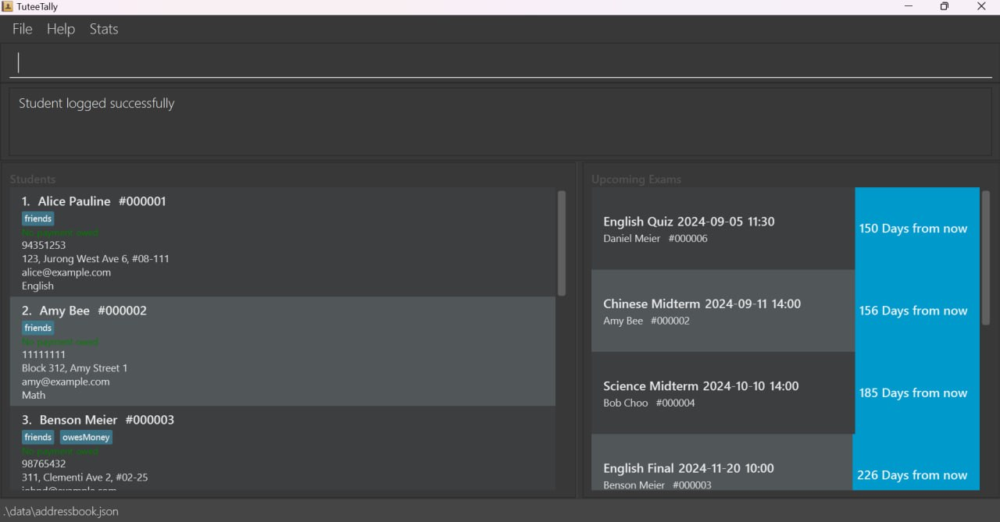 _The display reflects the successful logging for the student with ID #000001._

<box type="tip" seamless>

**Tip:** 

After successful addition, you can check your updated log list using the `view -id {ID}` command!

</box>

After entering the `view -id 000001` command, the interface will update as shown below:  

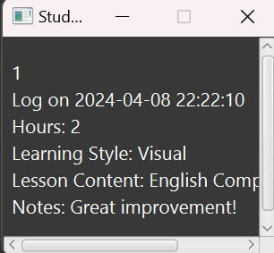  
_The display reflects the updated log entries for the student with ID #000001._

### Editing the data file

_Details coming soon ..._
TuteeTally's data is saved automatically as a JSON file at `[JAR file location]/data/addressbook.json`. Do proceed carefully if you intend to edit this file directly.

:exclamation: **Caution:**
Hence, it is recommended to make a backup of the file (by copying and pasting to another location) before editing it. 
Certain edits can cause the TuteeTally to behave in unexpected and magical ways (e.g., if a value entered is outside of the acceptable range). Therefore, edit the data file only if you are confident that you can update it correctly. It's up to you to ensure the validity of the data if you choose to edit it.

--------------------------------------------------------------------------------------------------------------------

## FAQ

**Q**: How do I transfer my data to another Computer? 
**A**: Install the app on the other computer and overwrite the empty data file it creates with the file that contains the data of your previous TuteeTally home folder.

**Q**: What are the system requirements for TuteeTally? 
**A**: TuteeTally requires Java 11 or above to run. It is compatible with Windows, MacOS, and Linux operating systems.

--------------------------------------------------------------------------------------------------------------------

## Known issues

1. **When using multiple screens**, if you move the application to a secondary screen, and later switch to using only the primary screen, the GUI will open off-screen. The remedy is to delete the `preferences.json` file created by the application before running the application again.
2. **When inputting long names above 220 characters**, the ID number of the students will be blocked even after the work around.[above](#adding-a-student-add)
3. **When using the payment commands**, the display will round the payment amounts to the nearest $0.01. So if you enter a payment of $0.001, it will be displayed as $0.00. However, the application will accurately track the exact amounts entered, without rounding.
4. **Empty white block when maximised**, currently there is an empty white block in the bottom when the app is maximised
5. **Empty white block in log when viewing students details**, currently there is an empty white block when viewing a student with no logs.

--------------------------------------------------------------------------------------------------------------------
## Command summary

| Action            | Format, Examples                                                                                                                                                                                                            |
|-------------------|-----------------------------------------------------------------------------------------------------------------------------------------------------------------------------------------------------------------------------|
| **Add**           | `add -name {NAME} -email {EMAIL} -phone {number} -address {ADDRESS} -subject {SUBJECT} t/{tag}`   e.g., `add -name Xiao Ming -phone 88888888 -email xiaoming@gmail.com -address 13, Computing Dr, 117417  -subject Math` |
| **Delete**        | `delete -id {ID}`  e.g., `delete -id 000001`                                                                                                                                                                             |
| **Edit**          | `edit {INDEX} -<Editable Fields> {Value}`   e.g., `edit 1 -phone 91234567 -email johndoe@example.com -name John Doo`                                                                                                     |
| **View**          | `view [-statistics] [-all] [-id ID] [-name NAME]`   e.g., `view -stats`, `view -all` , `view -id 000003`, `view -name Benson Meier`                                                                                      |
| **AddPayment**    | `addpayment -id {ID} -payment {AMOUNT}`  e.g., `addpayment -id 000001 -payment 100`                                                                                                                                      |
| **MarkPayment**   | `markpayment -id {ID} -payment {AMOUNT}`  e.g., `markpayment -id 000001 -payment 100`                                                                                                                                    |
| **ResetPayments** | `resetpayments -id {ID}`  e.g., `resetpayments -id 000001`                                                                                                                                                               |
| **AddExam**       | `addexam -id {ID} -exam {EXAMNAME} -date {DATE} -time {TIME OPTIONAL}`   e.g., `addexam -id 000001 -exam Computing -date 2024-04-27 -time 09:00`                                                                         |
| **DeleteExam**    | `deleteexam -id {ID} -exam {EXAMNAME} -date {DATE} -time {TIME}` or `deleteexam -id {ID} -exam {EXAMNAME} -date {DATE}`   e.g., `deleteexam -id 000001 -exam Computing -date 2024-04-27 -time 09:00`                     |
| **Log**           | `log -id {ID} -hours {HOURS} -content {CONTENT} -style {LEARNING STYLE} -notes {NOTES}`   e.g., `log -id 000001 -hours 2 -content English Comprehension -style Visual -notes Great improvement!`                         |
